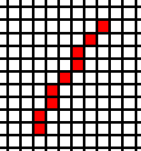

# CGSM Algos

Various Computer Graphics Algos

- [x] Digital Differential Analyzer (DDA) - Line and Polygon generating algorithm
    +  
- [ ] Midpoint subdivision algorithm
- [x] Bresenham's Line and Polygon algorithm
    +  
- [x] Bresenham's Circle algorithm
    + 
- [x] Bresenham's Ellipse algorithm
